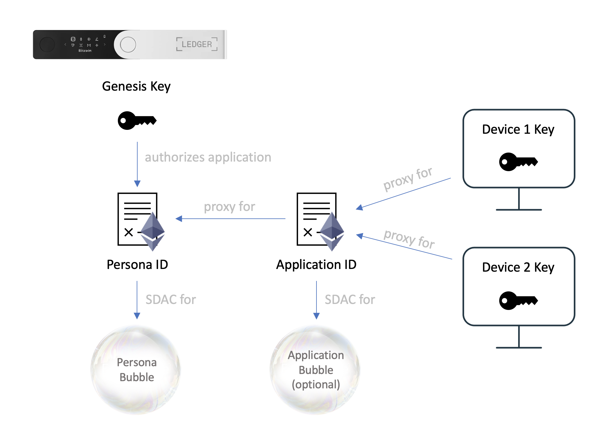

# Bubble Protocol Smart Contracts

This repository holds all the smart contracts used across the Bubble Protocol platform plus the project NFTs.  The repository is structured by sub-project.

## Bubble ID

Bubble ID uses a technology we call 'Proxy IDs'.  Proxy IDs are smart contracts that allow the owner to delegate powers to specific keys or to other Proxy IDs.  This allows different applications on different devices to act on behalf of a user's Bubble ID without the need to transfer private keys between devices.

When delegating, the owner can restrict powers to pre-defined roles (see [proxy-roles](bubble-id/proxyid/proxy-roles.txt)).  Applications can therefore be restricted so that they only have the powers they need and no more.  If Proxy IDs are chained then those restrictions apply down the chain so that no delegated Proxy ID can delegate more powers than it has been granted.

Bubble Protocol uses chains of Proxy IDs for it's [Persona](bubble-id/personas/Persona.sol) and [Application ID](bubble-id/applications/ApplicationId.sol) contracts so that instances of applications on different devices can act on behalf a persona using their own local private keys.

Being on the blockchain, these ID contracts are discoverable allowing the user to recover all of their personas, applications and bubbles from their single 'Genesis Key'. 

### Personas

When a user creates a new Persona in their [dashboard](https://datonavault.com/bubble), their genesis key deploys a [Persona contract](bubble-id/personas/Persona.sol) and permits their dashboard's [Application ID](bubble-id/applications/ApplicationId.sol) to act as an administrator of their persona.

The Persona contract also acts as a Smart Data Access Contract for the persona's bubble, which holds the persona's DID document, nickname and icon, and all of the personal data the user has entered for that persona.

### Applications

Bubble ID has an application authentication process similar to OAuth2.0.  When the user clicks the 'Access With Bubble' button in a DApp they are redirected to their bubble dashboard where they are shown the roles the DApp is requesting and can authorise which personas they want the DApp to use.  Once authorised, the user is redirected back to the DApp.

To authorise, the dashboard deploys an [Application ID](bubble-id/applications/ApplicationId.sol) contract and registers that ID with each authorised persona restricting it to the requested roles.  (The dashboard has admin rights over personas so it has the power to register new applications with them).  This creates a chain of IDs as shown in the diagram above.

The application ID can optionally control a bubble for holding metadata, user settings and syncing across devices.
## Bubble FS

Bubble FS is a private data storage layer for decentralised applications and organisations.  On Bubble FS, data is stored in a 'bubble', which is where Bubble Protocol gets it's name.

Bubbles can be large or trivially small. They are designed to be easily created and instantly accessible so that they can be used in everyday data transactions and decentralised applications. For example, the [Bubble Dashboard](https://datonavault.com/bubble) is a decentralised application that uses a bubble to store settings and metadata. This helps the application run smoothly and allows multiple installations across different devices to work as one.

A bubble is an off-chain, private, encrypted storage vault protected by an on-chain smart contract.  The smart contract that controls a bubble is known as a Smart Data Access Contract, or SDAC, and must implement the [sdac interface](bubble-fs/sdacs/SDAC.sol).  For more information about SDACs, see the [online documentation](https://datona-lib.readthedocs.io/en/latest/what.html#).

In this repository you will find some [example sdacs](bubble-fs/sdacs/examples) to use as a guide.  Also see [Bubble NFTs](#bubble-nfts).

## Bubble NFTs

Bubble Protocol's project-milestone NFTs use a [tailored ERC721 contract](bubble-nfts/BubbleNFT.sol) specially designed to allow personas (or more accurately, Proxy IDs) to own NFTs.  This allows a user to manage and transfer their NFT using any application with the 'publish' role on their persona.

The [Bubble Protocol project's NFT webpage](https://bubbleprotocol.com/nfts) uses the [Bubble Pass Chrome Extension](https://chrome.google.com/webstore/detail/bubble-pass/hdclcadfoglogdajchmemdgnggkboloa) to authenticate the user in the browser and retrieve any NFT images they own.  The images are retrieved from the project's NFT bubble, which permits only the owner of an NFT to access it's image.  See the `getPermissions` function within  [ERC721 controlled sdac](bubble-nfts/ERC721ControlledBubble.sol).

